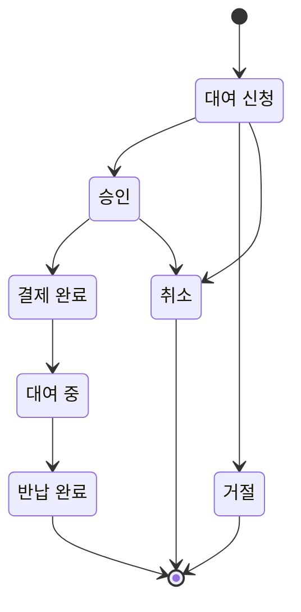

# SAVE 데이터베이스 ERD

현재 백엔드 JPA 엔티티를 기준으로 작성한 Mermaid ER 다이어그램입니다.

```mermaid
erDiagram
    UNIVERSITIES {
        integer id PK
        varchar name UK "NOT NULL, varchar(100)"
    }

    PICKUP_LOCATIONS {
        integer id PK
        integer university_id FK "NOT NULL"
        varchar name "NOT NULL, varchar(100)"
    }

    USERS {
        integer id PK
        integer university_id FK "NULL 허용"
        varchar email UK "NOT NULL, varchar(100)"
        varchar name "NOT NULL, varchar(50)"
        varchar department "NULL 허용, varchar(100)"
        varchar profile_image_url "NULL 허용, varchar(255)"
        varchar password_hash "NULL 허용, varchar(60)"
        varchar oauth_provider "NOT NULL, varchar(20)"
        varchar oauth_id "NOT NULL, varchar(100)"
        varchar role "NOT NULL, USER 또는 ADMIN"
        varchar status "NOT NULL, ACTIVE 또는 SUSPENDED"
        timestamp created_at "NOT NULL"
        timestamp updated_at "NOT NULL"
        timestamp sanctioned_until "NULL 허용"
        varchar sanction_reason "NULL 허용, varchar(500)"
    }

    ITEMS {
        integer id PK
        integer owner_id FK "NOT NULL"
        integer pickup_location_id FK "NULL 허용"
        varchar type "NOT NULL, LEND 또는 BORROW"
        varchar title "NOT NULL, varchar(100)"
        integer rental_fee "NOT NULL"
        varchar rental_unit "NOT NULL, HOUR DAY WEEK MONTH"
        text description "NULL 허용"
        text precautions "NULL 허용"
        varchar status "NOT NULL, AVAILABLE RESERVED RENTED DELETED"
        integer view_count "NOT NULL, 기본값 0"
        timestamp created_at "NOT NULL"
        timestamp updated_at "NOT NULL"
    }

    ITEM_IMAGES {
        integer id PK
        integer item_id FK "NOT NULL"
        varchar image_url "NOT NULL, varchar(500)"
        integer sort_order "NOT NULL"
        timestamp created_at "NOT NULL"
    }

    WISHLISTS {
        integer id PK
        integer user_id FK "NOT NULL"
        integer item_id FK "NOT NULL"
        timestamp created_at "NOT NULL"
    }

    CHAT_ROOMS {
        integer id PK
        integer item_id FK "NOT NULL"
        integer borrower_id FK "NOT NULL"
        integer lender_id FK "NOT NULL"
        timestamp created_at "NOT NULL"
    }

    CHAT_MESSAGES {
        integer id PK
        integer chat_room_id FK "NOT NULL"
        integer sender_id FK "NOT NULL"
        text message "NOT NULL"
        boolean is_read "NOT NULL, 기본값 false"
        timestamp created_at "NOT NULL"
    }

    RENTALS {
        integer id PK
        integer item_id FK "NOT NULL"
        integer borrower_id FK "NOT NULL"
        integer lender_id FK "NOT NULL"
        integer chat_room_id FK "NOT NULL"
        timestamp start_date "NOT NULL"
        timestamp end_date "NULL 허용"
        integer total_price "NOT NULL"
        varchar status "NOT NULL, RentalStatus"
        timestamp created_at "NOT NULL"
        timestamp updated_at "NOT NULL"
    }

    REPORTS {
        integer id PK
        integer reporter_id FK "NOT NULL"
        integer reported_user_id FK "NULL 허용"
        integer item_id FK "NULL 허용"
        integer chat_room_id FK "NULL 허용"
        varchar reason "NOT NULL, varchar(1000)"
        varchar status "NOT NULL, ReportStatus"
        timestamp created_at "NOT NULL"
        timestamp updated_at "NOT NULL"
        timestamp handled_at "NULL 허용"
    }

    RECOMMENDATIONS {
        integer id PK
        integer user_id FK "NOT NULL"
        varchar department "NULL 허용, varchar(100)"
        varchar time_period "NOT NULL, varchar(30)"
        boolean is_exam_period "NOT NULL"
        varchar weather_status "NOT NULL, varchar(30)"
        timestamp created_at "NOT NULL"
    }

    RECOMMENDATION_INTERESTS {
        integer recommendation_id FK "NOT NULL"
        varchar interest_item "NULL 허용, varchar(100)"
    }

    RECOMMENDATION_KEYWORDS {
        integer recommendation_id FK "NOT NULL"
        varchar keyword "NOT NULL, varchar(100)"
        integer display_order "NOT NULL"
    }

    RECOMMENDATION_ITEMS {
        integer recommendation_id FK "NOT NULL, 복합 UK"
        integer item_id FK "NOT NULL, 복합 UK"
        integer display_order "NOT NULL"
    }

    USER_DEVICE_TOKENS {
        integer id PK
        integer user_id FK "NOT NULL"
        varchar token UK "NOT NULL, varchar(512)"
        varchar platform "NOT NULL, ANDROID 또는 IOS"
        boolean enabled "NOT NULL, 기본값 true"
        timestamp updated_at "NOT NULL"
    }

    UNIVERSITIES ||--o{ PICKUP_LOCATIONS : "수령 장소 보유"
    UNIVERSITIES o|--o{ USERS : "사용자 소속"

    USERS ||--o{ ITEMS : "물품 소유"
    PICKUP_LOCATIONS o|--o{ ITEMS : "수령 장소 지정"
    ITEMS ||--o{ ITEM_IMAGES : "이미지 보유"

    USERS ||--o{ WISHLISTS : "찜 등록"
    ITEMS ||--o{ WISHLISTS : "찜 대상"

    ITEMS ||--o{ CHAT_ROOMS : "채팅 대상"
    USERS ||--o{ CHAT_ROOMS : "대여자 참여"
    USERS ||--o{ CHAT_ROOMS : "대여 제공자 참여"
    CHAT_ROOMS ||--o{ CHAT_MESSAGES : "메시지 보유"
    USERS ||--o{ CHAT_MESSAGES : "메시지 전송"

    ITEMS ||--o{ RENTALS : "대여 물품"
    USERS ||--o{ RENTALS : "대여자"
    USERS ||--o{ RENTALS : "대여 제공자"
    CHAT_ROOMS ||--o{ RENTALS : "대여 협의"

    USERS ||--o{ REPORTS : "신고 작성"
    USERS o|--o{ REPORTS : "사용자 신고 대상"
    ITEMS o|--o{ REPORTS : "물품 신고 대상"
    CHAT_ROOMS o|--o{ REPORTS : "채팅방 신고 대상"

    USERS ||--o{ RECOMMENDATIONS : "추천 요청"
    RECOMMENDATIONS ||--o{ RECOMMENDATION_INTERESTS : "관심 물품"
    RECOMMENDATIONS ||--o{ RECOMMENDATION_KEYWORDS : "추천 키워드"
    RECOMMENDATIONS ||--o{ RECOMMENDATION_ITEMS : "추천 결과"
    ITEMS ||--o{ RECOMMENDATION_ITEMS : "추천된 물품"

    USERS ||--o{ USER_DEVICE_TOKENS : "알림 기기 등록"
```

## 복합 유일 키

- `pickup_locations (university_id, name)`
- `users (oauth_provider, oauth_id)`
- `wishlists (user_id, item_id)`
- `chat_rooms (item_id, borrower_id, lender_id)`
- `recommendation_items (recommendation_id, item_id)`

## 상태 값

주의: JPA의 `cascade`는 애플리케이션 수준의 동작입니다. 현재 외래키에 DB 수준의
`ON DELETE CASCADE`는 명시되어 있지 않습니다.
