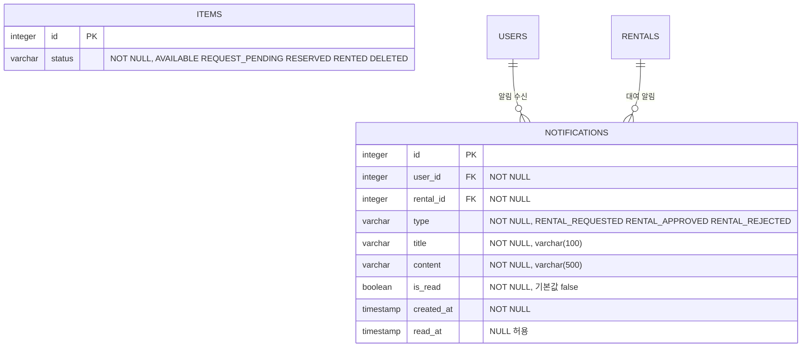

# 앱 안 알림 및 선착순 대여 잠금 설계

## 목표

현재 `SAVE`의 채팅 안정화 기능을 유지하면서 `SAVE_4-notification`의 앱 안 알림 기능을 선별 병합한다. 동시에 첫 번째 대여 요청이 들어온 물품을 `REQUEST_PENDING`으로 잠가, 한 물품에 하나의 활성 요청만 허용하는 선착순 대여 흐름을 만든다.

## 범위

- 대여 요청, 승인, 거절 알림을 데이터베이스에 저장한다.
- 로그인 사용자는 최근 알림을 조회하고 전체 읽음 처리할 수 있다.
- 새 알림은 개인 WebSocket 구독으로 실시간 전달한다.
- 첫 대여 요청이 성공하면 게시물 상태를 `REQUEST_PENDING`으로 변경한다.
- 요청 거절 또는 취소 시 게시물을 `AVAILABLE`로 복구한다.
- 승인, 대여 시작, 반납 상태를 기존 대여 상태 흐름과 일치시킨다.
- 현재 `SAVE`의 채팅 목록 병합, 중복 방지, 읽음 처리, 인증 변경 시 초기화를 보존한다.
- 데이터베이스 문서와 Mermaid ERD에 알림 테이블 및 새 게시물 상태를 반영한다.

다음 항목은 이번 범위에서 제외한다.

- Firebase를 이용한 대여 상태 앱 밖 푸시 알림
- 대여 취소, 결제, 대여 시작, 반납 완료 앱 안 알림
- 알림 페이지, 페이지네이션, 알림 삭제
- 홈 및 게시물 상세의 상대 시간 표시
- 프로필 이동, 대여 내역 디자인, 어드민 추가 개선

## 통합 전략

알림 버전의 프로젝트 전체를 덮어쓰지 않는다. 신규 알림 도메인 파일과 마이그레이션은 가져오고, 기존 파일은 알림에 필요한 최소 변경만 수동 병합한다.

신규 백엔드 구성 요소는 `InAppNotification` 엔티티, 저장소, 서비스, 컨트롤러, 응답 DTO, 알림 유형, 생성 이벤트 및 실시간 리스너다. 신규 프런트엔드 구성 요소는 알림 REST API 어댑터와 관련 테스트다.

`RentalService`, `WebSocketAuthorizationInterceptor`, `stompClient`, `useChatRooms`, `App`은 현재 `SAVE`를 기준으로 수정한다. 알림 폴더의 동명 파일로 교체하지 않는다.

## 대여 상태 모델

게시물 상태는 다음 다섯 가지를 사용한다.

```text
AVAILABLE
REQUEST_PENDING
RESERVED
RENTED
DELETED
```

정상 상태 전이는 다음과 같다.

```text
AVAILABLE
  -> REQUEST_PENDING  첫 번째 대여 요청 생성
  -> RESERVED         게시물 주인이 요청 승인
  -> RENTED           결제 완료 후 게시물 주인이 대여 시작
  -> AVAILABLE        반납 완료
```

예외 상태 전이는 다음과 같다.

```text
REQUEST_PENDING -> AVAILABLE  주인이 요청 거절
REQUEST_PENDING -> AVAILABLE  요청자가 승인 전 취소
RESERVED        -> AVAILABLE  요청자가 승인 후 취소
```

`PAID`는 `RentalStatus`에만 존재한다. 결제 완료 시 게시물은 `RESERVED`를 유지한다. `REJECTED`, `CANCELED`, `RETURNED`도 대여 기록 상태이며 게시물 상태로 추가하지 않는다.

게시물 주인이 상세 화면에서 게시물을 임의로 `RENTED` 또는 `AVAILABLE`로 전환하는 기존 버튼은 정식 대여 흐름과 충돌하므로 제거하거나 비활성화한다. 게시물 상태 변경은 대여 전이 API에서만 수행한다.

## 선착순 및 동시성

대여 생성 트랜잭션은 대상 물품 행을 쓰기 잠금으로 조회한다. 잠금을 획득한 뒤 물품이 `AVAILABLE`이고 활성 대여 기록이 없는지 다시 검사한다.

첫 요청은 대여 기록을 저장하고 물품을 `REQUEST_PENDING`으로 변경한다. 동시에 도착한 다음 요청은 잠금이 풀린 뒤 `REQUEST_PENDING` 상태를 확인하고 HTTP 409로 실패한다. 따라서 애플리케이션의 사전 조회 결과와 무관하게 데이터베이스 트랜잭션이 최종 선착순을 결정한다.

대여 생성, 게시물 상태 변경, 앱 안 알림 저장 중 하나라도 실패하면 전체 트랜잭션을 롤백한다. 실시간 알림은 커밋 이후에만 전송한다.

## 앱 안 알림

초기 알림 유형은 다음 세 가지다.

```text
RENTAL_REQUESTED  요청 생성 후 게시물 주인에게 전달
RENTAL_APPROVED   주인 승인 후 요청자에게 전달
RENTAL_REJECTED   주인 거절 후 요청자에게 전달
```

알림은 수신 사용자와 대여 기록을 필수 참조한다. 제목, 내용, 생성 시각, 읽음 여부와 읽은 시각을 저장한다.

REST API는 다음 기능을 제공한다.

```text
GET   /api/v1/notifications
GET   /api/v1/notifications/unread-count
PATCH /api/v1/notifications/{notificationId}/read
PATCH /api/v1/notifications/read-all
```

사용자는 자신의 알림만 조회하거나 읽음 처리할 수 있다. 목록은 최근 50개를 생성 시각 역순으로 반환한다.

서버는 트랜잭션 커밋 후 `/user/queue/notifications`로 새 알림을 전송한다. 프런트엔드는 REST로 초기 목록을 불러온 뒤 WebSocket 알림을 앞에 추가하며, 알림 ID로 중복을 제거한다.

상단 종 모양 버튼은 안 읽은 알림이 하나라도 있으면 표시점을 보여준다. 알림 목록은 빈 상태와 전체 읽음 실패를 처리한다. 현재 구현 범위에서는 알림 항목 클릭 시 개별 읽음이나 화면 이동을 수행하지 않는다.

## 오류 처리

- 이미 잠긴 물품에 대한 대여 요청은 HTTP 409를 반환한다.
- 권한 없는 사용자의 승인, 거절, 취소, 읽음 처리는 기존 403/404 정책을 유지한다.
- REST 알림 목록 조회 실패는 기존 알림 상태를 임의로 읽음 처리하지 않고 오류 토스트를 표시한다.
- 실시간 연결이 끊겨도 저장된 알림은 다음 REST 조회에서 복구된다.
- 실시간 전송 실패가 이미 커밋된 대여 트랜잭션을 되돌리지는 않는다.

## 데이터베이스 변경

`items.status`는 문자열 열이므로 열 구조는 변경하지 않고 `REQUEST_PENDING` 값만 새로 사용한다.

`V3__create_in_app_notifications.sql`은 빈 `notifications` 테이블과 다음 인덱스를 추가한다.

- `(user_id, created_at)`: 사용자별 최신 알림 조회
- `(user_id, is_read)`: 사용자별 안 읽은 알림 개수 조회

기존 테이블이나 데이터는 삭제하거나 변환하지 않는다.

ERD 변경분은 다음과 같다.



전체 Mermaid에서는 기존 `ITEMS.status` 설명을 교체하고 `NOTIFICATIONS` 엔티티와 두 관계를 추가한다. 나머지 엔티티와 관계는 유지한다.

## 테스트 전략

백엔드 테스트는 다음을 검증한다.

- 첫 요청이 `RentalStatus.REQUESTED`와 `ItemStatus.REQUEST_PENDING`을 함께 만든다.
- 두 번째 활성 요청은 409로 거절된다.
- 승인 시 `RESERVED`, 거절 및 취소 시 `AVAILABLE`, 시작 시 `RENTED`, 반납 시 `AVAILABLE`이 된다.
- 요청, 승인, 거절 알림의 수신자와 유형이 정확하다.
- 다른 사용자의 알림을 읽음 처리할 수 없다.
- 커밋 후 개인 WebSocket 목적지로 알림이 전달된다.

프런트엔드 테스트는 다음을 검증한다.

- 저장된 알림 목록을 상단 종 메뉴에 표시한다.
- 실시간 알림을 중복 없이 추가한다.
- 전체 읽음 API 성공 후 표시점이 사라진다.
- 알림 통합 후에도 채팅 목록 병합, 읽음 처리, 로그아웃 초기화 테스트가 유지된다.

최종 검증은 백엔드 전체 테스트, 프런트엔드 전체 테스트, ESLint, 프로덕션 빌드로 수행한다.
